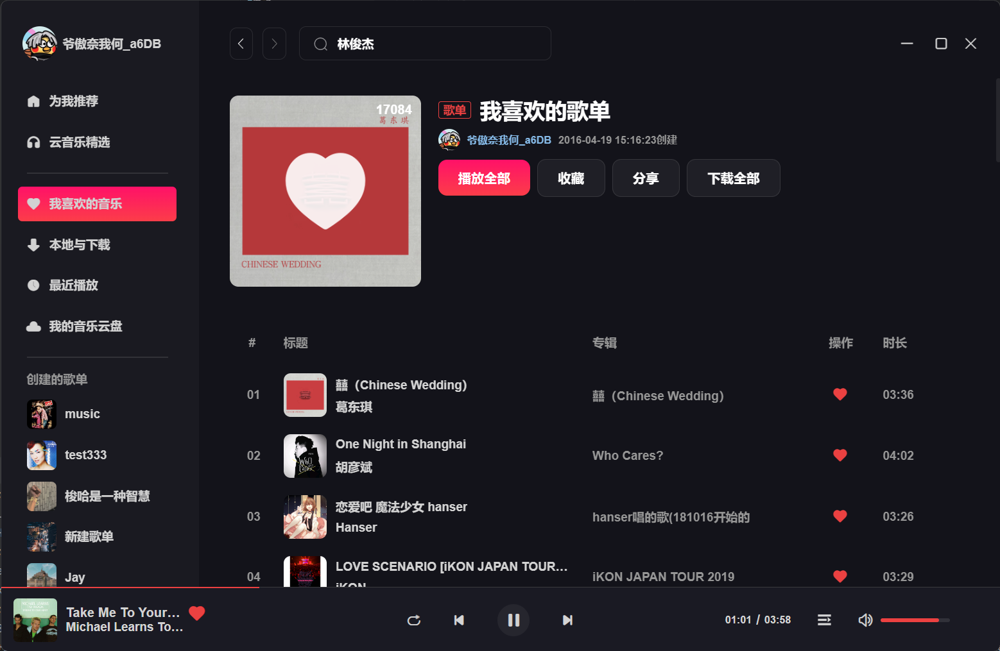
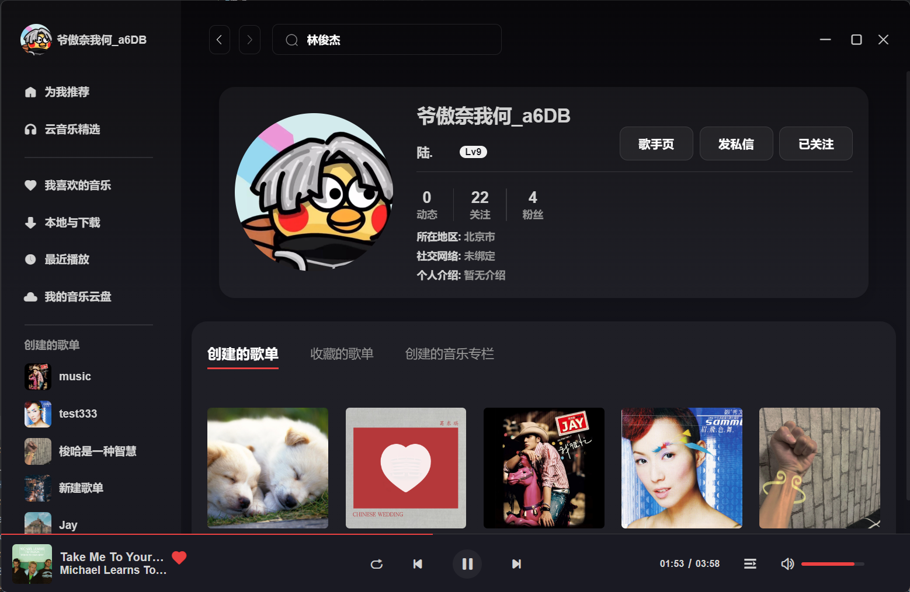
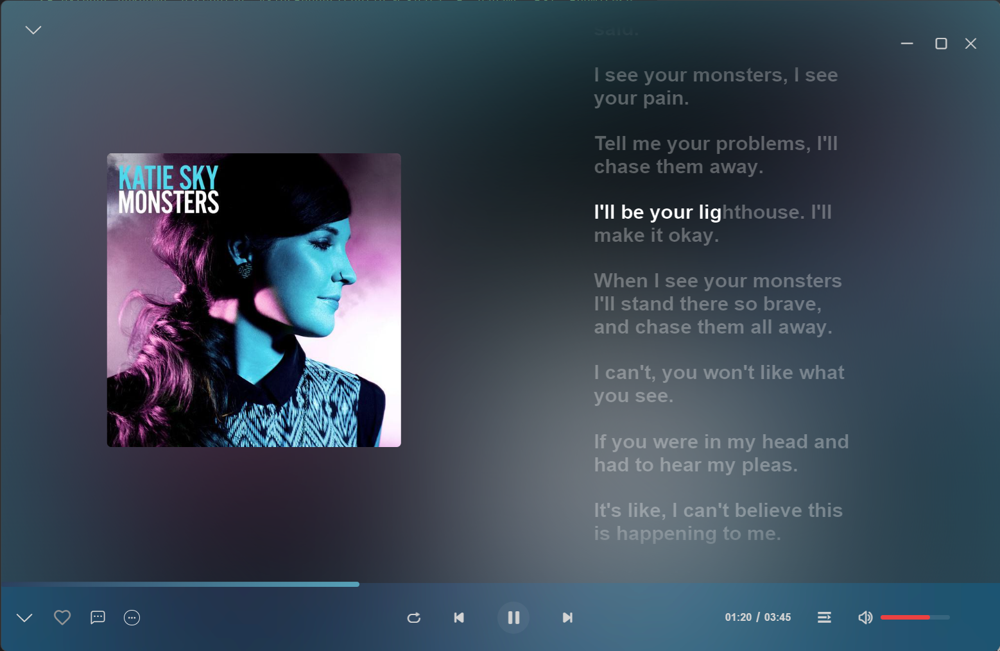
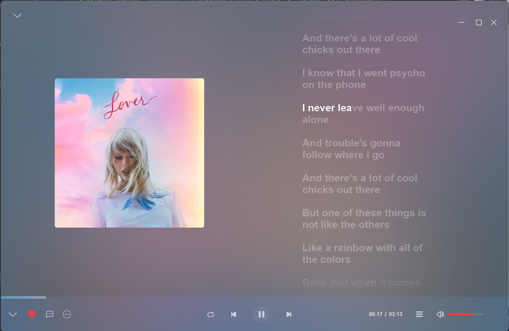
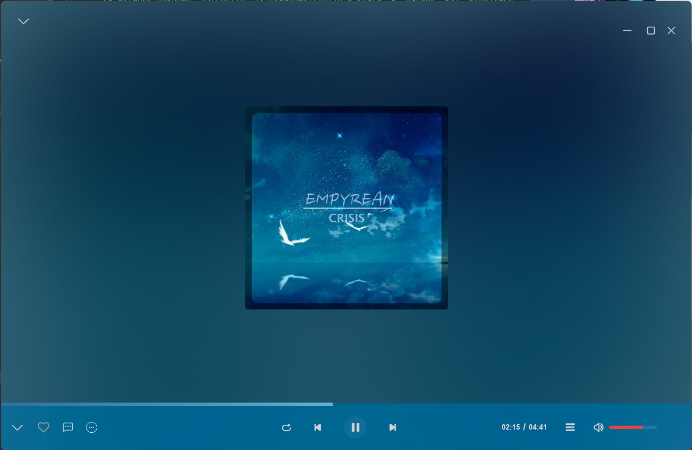
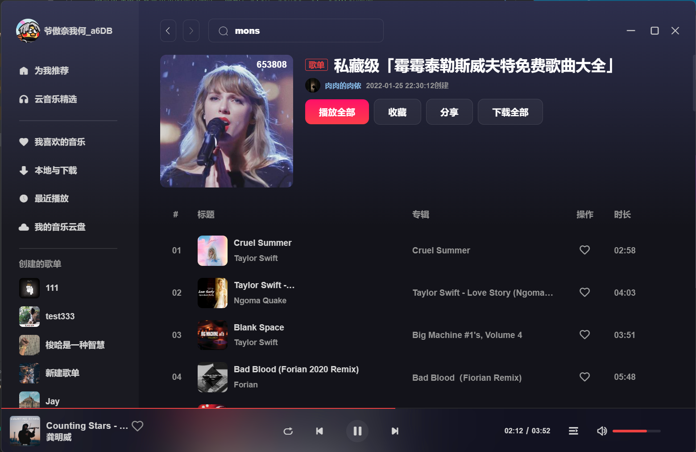

# Vue3 + TypeScript + Vite + Electron
## 如有任何问题请创建issues

### 在这里提供了一个逐字歌词的npm包
https://www.npmjs.com/package/@lrc-player/core

## 安装

### 1. 安装本地服务器
git clone https://gitlab.com/Binaryify/NeteaseCloudMusicApi.git

```
1. 安装依赖
npm/yarn install
2. 启动服务
npm/yarn start

这个服务器默认端口号应该是3000
```

### 2. 启动 cloud
```
1. node版本至少大于15

2. 安装依赖
yarn install

3. 启动服务
yarn dev

4. 打包应用
electron: yarn build-electron
web: yarn build


默认请求端口号为3006, 可以在.env 文件中更改VITE_APP_WEB_URL
    例如服务器端口号为3000，就把VITE_APP_WEB_UR改为3000
```

### 3. 登录
```
1. 使用网易云音乐APP扫码登录
```


# 请求器
````
当父组件通过模板 ref 的方式获取到当前组件的实例，获取到的实例会像这样 { a: number, b: number } (ref 会和在普通实例中一样被自动解包)
项目里集成了components文件下自动引入,您可以无需引入直接使用即可（推荐引用,这样可以让ts更好的识别类型）

vite 提供了两种模式：具有开发服务器的开发模式（development）和生产模式（production）
组件中使用：
console.log(import.meta.env.VITE_APP_WEB_URL)

请求器一共有四种调用方式   配置型请求默认为get，其余三种默认都为post
  <R extends unknown, D>(config: AxiosRequestConfig & {data: R, params: R}): Promise<D>;
  <R extends unknown, D>(url: string, method?: Method, config?: AxiosRequestConfig & {data: R, params: R}): Promise<D>;
  <R extends unknown, D>(url: string, data: R, method?: Method): Promise<D>;
  <R extends unknown, D>(url: string, data: R, config?: AxiosRequestConfig): Promise<D>;
  
重写了audio的play和pause，让他们具有音量过渡效果
    开始播放的过渡时间比暂停长一点，这样效果感觉会更好些
````

# 引用
````
在全局上暴露了播放器的组件实例, $audio, 它被挂在到了window上
你可以调用其暴露出来的部分方法, 例如: play、pause、el、isPlay等等...

````

# 一些效果图...








# Electron API
```
win.maximize() // 最大化窗口
win.unmaximize() // 取消最大化窗口
win.minimize() // 最小化窗口
win.restore() // 将窗口从最小化状态还原到其以前的状态
win.close() // 尝试关闭窗口。这与用户手动单击窗口的关闭按钮具有相同的效果
```
